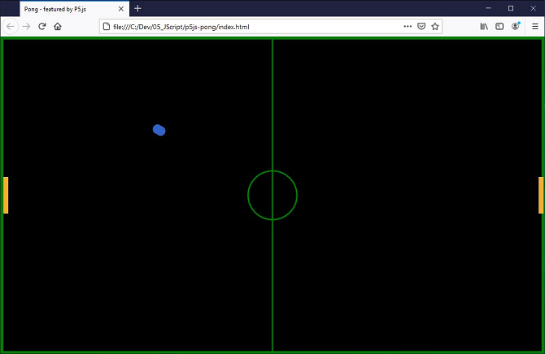

# 👀 p5js - Pong

Quick and dirty proof of concept of the old Arcade game Pong using the [p5js](https://p5js.org/) library.

## Basic Usage

1.  Download files to your computer
2.  Open index.html file in a modern browser (e.g. Firefox)
3.  Press [Enter] to start the game
4.  Player 1 moves the left paddle using the `q` (UP) and `a` (DOWN) keys.
5.  Player 2 moves the right paddle using the `CURSOR_UP` and `CURSOR_DOWN` keys.

## Possible improvments

This was my first trial with the p5js library, so game layout etc. could be improved in a lot of areas. In fact there are countless options like creating static and movable object classes including position, movement and collision detection for all objects used, adding sound effects, counters, nicer graphics and other things. However, my time and resources are limited. However, feel free to improve or add features on your own.

Have fun
cwsoft
